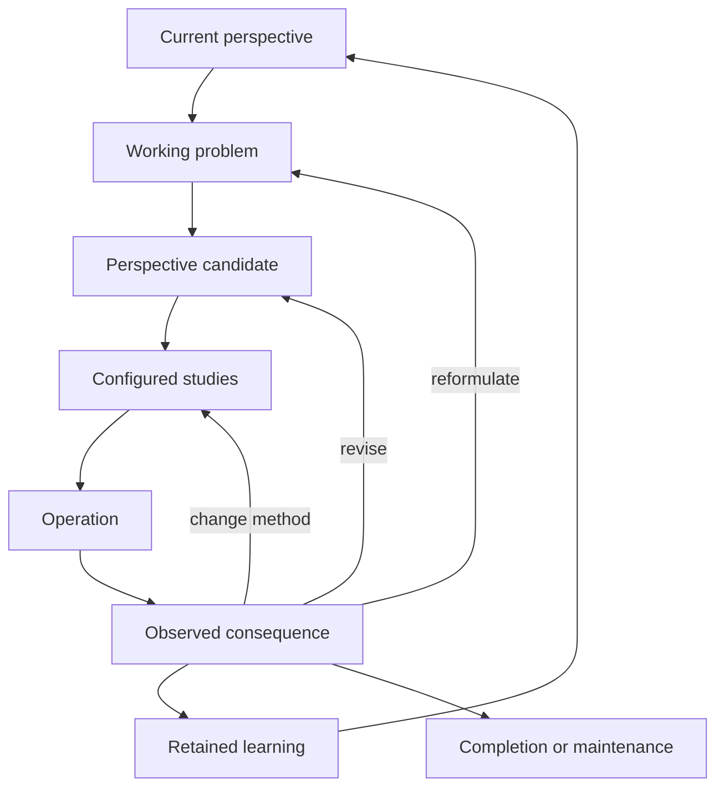

# Perspective structure and process

Working account — 7 September 2026

This document develops the user's proposed relationship between problem recognition, perspective adoption, and the selection of Subject Systems. It also incorporates the current attachment's requirements: identify each technique's adopted perspective, intended problem, recognition conditions, operations, effectiveness, reliability, starting conditions, and end conditions. Definitions and proposed mechanisms below are research proposals unless explicitly identified as an existing repository definition or a finding from a cited study.

**The central relationship.** A perspective helps determine what work a situation calls for. The studies selected to do that work can then change the perspective, including what was originally identified as the problem.

The proposed sequence—recognize a problem, adopt a perspective, select relevant subject systems, attempt resolution—captures an important part of this relationship. Two extensions make it more complete. First, recognition already proceeds from some distinctions, expectations, concerns, and prior experience. Second, a selected study can discover that the initial interpretation, goal, or selected subject was inadequate. The process therefore has several entry points and feedback paths.

For example, “I understand this explanation but cannot use it” can be treated as a missing fact, a missing retrieval cue, a representation problem, an absent operation, an approach selection problem, or a transfer problem. Each interpretation makes different intellectual work relevant. Better work on the wrong interpretation can leave the actual difficulty intact.

**A proposed definition.** A perspective is an operative interpretation of a matter that makes particular distinctions, concerns, and responses relevant.

“Operative” means the interpretation participates in what is noticed, inferred, sought, chosen, experienced, or done. A description of a perspective can exist without anyone adopting it. A person can also operate with distinctions that they cannot articulate. This definition is a proposed functional account; it does not establish that perspective is a single neural object or identical to consciousness.

**Subject Systems already supplies much of the material.** The inspected local catalog contains 449 defined subject proposals under 52 navigation headings. A subject identifies a determination that can be studied. It can become the focus of a perspective, contribute to several perspectives, or be used to examine a perspective itself. The catalog is therefore a substantial basis for discovering perspectives. It is not yet a list of every complete perspective or a completed account of their formation and use.

| Term | What it identifies | Example |
| --- | --- | --- |
| Subject | A specified matter of consideration | Reasoning approach selection |
| Study | Actual inquiry into a subject | Determine which available approach can address this transfer difficulty |
| Perspective | An operative interpretation making certain distinctions, concerns, and responses relevant | Treat the difficulty as failure to recognize when an already-known approach applies |
| Technique | Specified operations intended to change an initial condition | Compare a matched pair of cases to expose the distinguishing application condition |
| System | An arrangement of contributors, relations, and operations | Combine case selection, application-condition discovery, practice, and later retrieval |
| Perspective description | An account of a perspective | A record of its assumptions, distinctions, consequences, and revision conditions |
| Perspective adoption | A perspective becoming operative with some degree of commitment | Use the application-condition interpretation to select the next comparison |

These are distinguishable roles and relations. A perspective can itself be a subject of study. A study can use a system. A system can include studies alongside records, instruments, people, and operations. A collection of subject names does not by itself specify their arrangement or what their results do.

**What a perspective needs to describe.** The following fields are useful for making an applied perspective inspectable. They are not claimed to be independent components of every human mental state. Some can remain implicit until a difficulty makes them relevant.

| Field | Determination | Example: understanding that does not transfer |
| --- | --- | --- |
| Target | What matter is being considered? | Applying a familiar idea to a new case |
| Scope | Which cases, boundaries, units, and time spans are included? | Problems requiring the same principle despite different wording |
| Concern | What is wanted, preserved, avoided, or explored? | Independent use, rather than recognition of familiar prose |
| Beneficiary | Whose result or experience matters here? | The learner attempting the new problem |
| Role | What kind of contribution is currently sought? | Diagnose the source of failure |
| Representation | How is the matter organized? | Old and new cases represented by their relevant relations |
| Distinctions | Which differences change interpretation or response? | Surface resemblance versus application conditions |
| Assumptions | What is being provisionally taken as given? | The learner can already execute the approach when cued |
| Attention | What is brought forward or left in the background? | The earliest step at which independent performance fails |
| Possibilities | Which interpretations, outcomes, and operations are available? | Missing cue, missing operation, wrong approach, unsuitable case |
| Standard | What would count as a better result? | Successful independent use on a relevant unfamiliar case |
| Conditions | What information, resources, permissions, and capabilities are available? | Access to a worked example, a new case, and the learner's attempt |
| Commitment | Is this a temporary assumption, a live candidate, or an adopted basis for action? | Application-condition failure is a candidate to investigate |
| Continuation | What follows from each materially different result? | Success when cued directs attention toward recognition; failure when cued requires another account |
| Revision | What would require changing this interpretation? | The supposedly known operation cannot actually be performed |
| Completion | What ends this use of the perspective? | An identified next intervention, a resolved difficulty, or an explicit unresolved dependency |

A short perspective description can therefore take this form:

> In these conditions, treat this matter as this kind of situation, attend to these distinctions, pursue this result, use these operations, and revise the interpretation if these consequences occur.

This is a description form, not a requirement to fill sixteen fields before ordinary action. A useful perspective can first emerge in a comparison, diagram, action, or experience and only later become describable.

**What “all possible perspectives” requires.** We can list the current subjects, describe known perspective patterns, and systematically construct additional candidates. We cannot honestly certify a finite list as every possible perspective while new subjects, distinctions, purposes, contexts, and operations remain admissible.

The companion document lists all 449 subject records in the inspected catalog, preserving their targets and exclusions. Those records are possible foci. The sixty patterns below go further by stating how a matter is interpreted and what that interpretation makes useful. Neither list is presented as a finished universal taxonomy.

Perspective generation can proceed by making one meaningful change:

| Change | Concrete contrast |
| --- | --- |
| Target | The answer is under examination; the question is under examination |
| Problem attribution | Missing information; missing operation |
| Scope | One failed attempt; a pattern across many attempts |
| Unit | An isolated choice; a sequence of dependent choices |
| Time | Immediate completion; preservation of future options |
| Role | Explain an outcome; construct an intervention |
| Beneficiary | The person acting; another person affected by the result |
| Representation | A list of components; a map of dependencies |
| Distinction | Whether an approach is familiar; whether its application conditions hold |
| Assumption | A constraint is fixed; the constraint can be changed |
| Standard | One impressive outcome; consistent performance in the intended conditions |
| Commitment | Explore a possibility; rely on it for action |
| Available action | Choose among existing methods; construct a missing method |
| Resource | Solve without external memory; use a maintained external record |
| Stopping condition | Produce an answer; establish what would resolve the matter |
| Revision rule | Preserve the goal and change the means; reconsider whether the stated goal expresses the concern |

The resulting combinations must be checked for coherence and relevance. Merely multiplying labels creates combinations, not necessarily useful perspectives. A change is substantive when it changes a consequential distinction, interpretation, experience, available operation, or continuation in some specified case. Identical behavior on one case is insufficient to establish that two perspectives are equivalent everywhere.

**The perspective optimization process.** The steps below describe functional contributions. Human and machine activity may combine them, repeat them, or enter in the middle.

1. **Encounter conditions.** Begin with a situation, prior experience, present concerns, available resources, and an already operative way of making sense of them.
2. **Notice a possible matter.** Detect a discrepancy, opportunity, uncertainty, conflict, request, maintenance need, or source of curiosity. What is noticed partly depends on the current perspective.
3. **Formulate a working problem.** Specify what appears unresolved and what resolution would involve. Distinguish the existence of a problem, its description, its importance, and its cause.
4. **Activate or construct a perspective.** Retrieve a familiar interpretation, compare candidates, alter a component, or construct an interpretation absent from the available inventory. Identify the consequence that makes the candidate worth trying.
5. **Configure the required work.** Select subjects, identify what each must settle, assign the role of its result, choose suitable techniques, and arrange their dependencies. Where no adequate technique is available, the next subject may be approach creation.
6. **Perform a consequential operation.** Observe, compare, derive, create, choose, act, maintain, or deliberately experience something that can change the situation or the available understanding.
7. **Interpret the consequence.** Determine what occurred, which expectation it bears on, and whether a changed result came from a changed perspective, information, method, goal, or resource.
8. **Revise the relevant part.** Update evidence, distinctions, problem formulation, approach, criterion, goal, environment, or perspective. A disappointing result does not uniquely diagnose which part was wrong.
9. **Retain a usable change.** Preserve the application conditions, distinguishing cue, useful operation, limitation, or transition so that later recognition and action can improve.
10. **Continue or finish appropriately.** Proceed, switch perspective, combine contributions, maintain a result, stop, or identify the observation or resource needed for progress.

The application therefore needs to learn more than which technique tends to follow a problem label. It needs to learn how a situation becomes recognizable as requiring that work, what different results mean, and when the framing itself should change.

**Starting conditions and end conditions.** These are distinct states, not mutually exclusive classes of whole projects. Several can hold simultaneously.

| Starting condition | Useful immediate target | Possible end condition |
| --- | --- | --- |
| Something feels wrong, but the difficulty is unspecified | Problem formulation | A concrete unresolved matter or a warranted dismissal of the suspected problem |
| A stated problem presupposes something unsettled | Presupposition examination | A corrected question or a supported presupposition |
| Several formulations suggest different work | Formulation discrimination | A reason to pursue one formulation, combine contributions, or gather a distinguishing observation |
| The problem is specified but its cause is unknown | Explanation discrimination | A supported causal account or a narrowed set of alternatives |
| The cause is understood but no remedy is available | Remedy creation | A concrete candidate intervention with relevant conditions |
| Several remedies are available | Remedy comparison | A justified choice or a specified incomparability |
| A method name is available but its operations are absent | Approach specification or creation | Operations that can actually be performed, with a bounded claim about their contribution |
| The necessary distinction is absent from the representation | Representation modification | A representation exposing the distinction needed for progress |
| Information is missing | Information relevance determination | A targeted observation, a robust action despite uncertainty, or a justified dependency |
| Evidence conflicts | Conflict source examination | A resolved discrepancy or an explicitly retained conflict |
| The comparison standard is unclear | Criterion specification | A usable standard with its scope and unresolved value choices stated |
| Several standards favor different outcomes | Criterion conflict examination | A justified tradeoff, preserved alternatives, or an unresolved conflict |
| A known operation cannot be performed | Resource or capability examination | A feasible arrangement, a missing prerequisite, or a demonstrated limitation under present conditions |
| Performance succeeds only in familiar cases | Transfer condition discovery | A relevant distinguishing cue, a scope limitation, or a changed method |
| The desired result already holds | Maintenance requirement examination | Continued preservation with suitable attention and response conditions |
| No specific result is yet sought, but exploration is worthwhile | Opportunity discovery | A new question, distinction, option, experience, or promising direction |
| A proposed change could close valuable future options | Reversibility examination | A choice that accounts for the options preserved or lost |
| Further effort no longer changes the relevant decision | Continuation value examination | A warranted stop or an identified reason to continue |

A technique's end condition is often an input to the next study. Finding a counterexample may complete an inference study while leaving the original practical problem unresolved. Completing an explanation may leave execution untouched. “Resolved” should therefore identify what has been resolved.

**Formation, use, and change.** “Perspective selection” is useful, but it should not erase other processes that the project needs to distinguish.

| Operation | Literal target | Example |
| --- | --- | --- |
| Perspective acquisition | Make an existing perspective newly available to an agent | Learn to identify a problem by its governing relationship |
| Perspective construction | Produce an operative interpretation absent from the initial inventory | Discover that a repeated “knowledge failure” is actually a missing retrieval condition |
| Perspective activation | Bring an available perspective into operation | A familiar cue brings a practiced interpretation forward |
| Perspective selection | Choose among available perspectives | Compare a missing-information account with a representation account |
| Perspective adoption | Give a perspective some operative commitment | Use one account to direct the next inquiry |
| Perspective enactment | Carry out the distinctions and operations it makes relevant | Compare cases by their application conditions |
| Perspective maintenance | Keep an adopted perspective available during continued activity | Preserve the intended target across an interruption |
| Perspective modification | Change part of an operative interpretation | Broaden the time horizon without changing the intended beneficiary |
| Perspective replacement | Discontinue one operative interpretation in favor of another | Move from a remedy search to a problem reformulation |
| Perspective composition | Arrange contributions from several perspectives | Use a causal account to propose an intervention, then examine its feasibility |
| Perspective transfer | Apply a perspective in a new domain or context | Recognize the same dependency structure in a different subject |
| Perspective abandonment | Stop using a perspective | Discontinue a framing whose presupposition has failed |

These descriptions are proposed research targets, not a claim that all twelve are already established standalone subjects or implemented techniques. Selection presupposes candidates. Construction changes the candidate inventory. Activation can happen without comparison. Adoption can be tentative. A system that only compares already named perspectives will miss much of the intended capability.

**What can influence perspectives.** An applied account should investigate several possible routes of influence, retaining the possibility that their effects differ by task and agent.

| Influence | What it can change | Question needed to specify the effect |
| --- | --- | --- |
| Direct observation | Available evidence or a consequential distinction | What observation would change the current interpretation? |
| Repeated outcomes | Expectations, cues, or response tendencies | What was reinforced, and does it remain suitable here? |
| Concepts and vocabulary | Which differences can be expressed or recognized | Which distinction becomes available through the concept? |
| Examples | The inventory of recognizable situations | Which relation is learned, and which surface detail is incidental? |
| Contrasting cases | The boundary between relevantly different situations | What changes between the cases that changes the appropriate response? |
| Analogy | A candidate structure from another context | Which relations transfer, and where does the mapping fail? |
| Current concerns | The significance assigned to an observation | What makes this matter relevant now? |
| Incentives | What outcomes receive attention or effort | Does the rewarded proxy match the intended result? |
| Social accounts | Available interpretations, norms, or expectations | Which claims are being learned, and on what grounds are they adopted? |
| Role | The contribution currently expected of the agent | What changes when the person observes, teaches, chooses, or executes? |
| Emotional or bodily state | Candidate changes in salience, urgency, or capacity | Which effect is actually present in this case, rather than merely assumed? |
| Tools and environment | Accessible representations and executable operations | Which perspective becomes usable because the environment supports it? |
| Memory and retrieval cues | Which available perspective is encountered at the right time | What reliably brings the useful interpretation forward? |
| Failure or surprise | Evidence against an expectation or its conditions | Which assumption, method, or context condition did the result bear on? |
| Deliberate perspective practice | Availability and differentiation of alternatives | Does the agent recognize when to use and leave the practiced perspective? |
| Reflection on earlier transitions | Knowledge of how useful changes occurred | What made the later perspective reachable from the earlier one? |

This table defines an investigation agenda. It is not evidence that every influence always improves perspectives. Experience can support a useful interpretation or reinforce an unsuitable one.

**Human cognition provides several relevant, bounded findings.**

In physics problem studies, experts organized problems more by underlying principles, while novices relied more on literal features. This supports the importance of the representation through which a problem becomes recognizable and an approach becomes relevant. [Chi, Feltovich, and Glaser, 1981](https://onlinelibrary.wiley.com/doi/10.1207/s15516709cog0502_2).

Different formulations of decision problems produced preference reversals in experiments on choice. Changing a perspective or formulation can therefore change a verdict without establishing that the new verdict is better. [Tversky and Kahneman, 1981](https://pubmed.ncbi.nlm.nih.gov/7455683/).

Previously rewarded visual features captured attention even when they were task irrelevant. What becomes salient can reflect learned history alongside the current task. [Anderson, Laurent, and Yantis, 2011](https://pubmed.ncbi.nlm.nih.gov/21646524/).

In a human instrumental learning experiment, more extensive training reduced sensitivity to a reduction in the outcome's value. Repeated performance need not involve a newly considered choice of perspective on every occasion. This challenges a fresh-selection account without ruling out an account of implicit operative perspectives. [Tricomi, Balleine, and O'Doherty, 2009](https://pmc.ncbi.nlm.nih.gov/articles/PMC2758609/).

In a multistep choice task, behavior reflected both knowledge of task structure and learned reward tendencies. An account of perspective use should allow different routes to a response rather than assuming one uniform deliberative mechanism. [Daw and colleagues, 2011](https://pmc.ncbi.nlm.nih.gov/articles/PMC3077926/).

These findings motivate parts of the proposed model. They do not establish that all human activity is perspective selection, that every act begins with an articulated problem, or that perspective optimization is a demonstrated account of consciousness.

**Is everything humans do perspective selection?** There are several materially different claims.

1. Every activity can be described from some perspective. This concerns what an observer can do; it does not establish the person's mechanism.
2. Human activity can often be understood through the operative distinctions, concerns, expectations, and responses involved. This is the useful broad research direction developed here.
3. Every human action selects among represented alternatives. This is a stronger claim that needs a mechanism and evidence; activation, habit, and execution cannot simply be renamed without losing distinctions.
4. Every action involves conscious selection. The proposed framework does not require this claim.
5. Every activity is problem solving. This can be a useful broad convention if “problem” includes maintenance, exploration, and ongoing desired experience. Under the narrower meaning of repairing a recognized defect, it misses some activities.

The project becomes more explanatory when it asks which of these descriptions applies, how the relevant process works, and what observable difference follows. Deliberate selection, automatic activation, construction, and sustained enactment should remain distinguishable even if they all belong within a broader perspective account.

**Sixty perspective patterns.** Each row gives a literal working name, an interpretation, and the work it makes relevant. These are reusable patterns requiring a particular target and context before they become complete applied perspectives. The groups support reading; they do not impose exclusive folders on all perspectives. Their names are not automatically additions to the repository's subject catalog.

The first twelve concern what the situation calls for.

| No. | Perspective pattern | Treat the situation as… | Work made relevant |
| --- | --- | --- | --- |
| 1 | Problem existence | A suspected difficulty whose existence is unsettled | Identify a concrete discrepancy and the condition that makes it a problem |
| 2 | Problem formulation | A difficulty that may have been described inadequately | Construct alternative formulations and identify how their required work differs |
| 3 | Problem location | A failure that may arise at a different stage or boundary | Locate the earliest consequential divergence from the intended result |
| 4 | Problem recurrence | One occurrence of a repeating pattern | Compare occurrences to distinguish recurring conditions from incidental details |
| 5 | Problem priority | One demand among competing demands | Determine which unresolved matter most affects the intended outcomes |
| 6 | Problem avoidability | A difficulty whose generating conditions may be changeable | Find whether altering a prerequisite prevents the difficulty from arising |
| 7 | Goal meaning | A stated goal that may only partly express the underlying concern | Identify what achieving it is expected to make possible |
| 8 | Goal necessity | A proposed goal whose necessity is unestablished | Find whether the underlying concern can be met without that goal |
| 9 | Goal prerequisite | An outcome dependent on missing conditions | Determine which conditions must hold before the outcome is attainable |
| 10 | Goal compatibility | Several desired outcomes that may interfere | Specify where achieving one prevents, enables, or leaves another unaffected |
| 11 | Goal replacement | A current objective that may have lost its purpose | Examine whether its original reason still holds and construct a replacement if needed |
| 12 | Goal maintenance | An already achieved condition that can deteriorate | Identify sustaining conditions and appropriate responses to deviation |

The next twelve concern what to believe or expect.

| No. | Perspective pattern | Treat the situation as… | Work made relevant |
| --- | --- | --- | --- |
| 13 | Claim specification | An assertion whose exact content is unclear | Fix its reference, quantifiers, scope, and truth conditions |
| 14 | Claim implication | An assumption whose consequences are not yet understood | Derive conditional consequences while retaining their premises |
| 15 | Claim failure | A proposition or inference that may fail in identifiable cases | Construct a relevant countercase or specify the limits of the search |
| 16 | Claim support | A conclusion whose grounds need examination | Identify evidence, dependence, defeaters, and what acceptance is justified |
| 17 | Explanation cause | An outcome produced through some process | Construct and compare causal accounts that could produce the observed difference |
| 18 | Explanation contrast | A difference between what happened and a specified alternative | Identify what explains that particular contrast |
| 19 | Explanation alternative | An observation compatible with multiple accounts | Construct accounts that disagree about a further observation or intervention |
| 20 | Explanation discrimination | Competing accounts needing a separating result | Find an accessible observation with different implications for the accounts |
| 21 | Uncertainty relevance | Missing knowledge whose importance is unsettled | Determine whether plausible answers change the appropriate next action |
| 22 | Uncertainty reducibility | An unresolved distinction that may or may not be accessible | Identify an attainable observation or specify the present limit |
| 23 | Prediction correspondence | An expectation whose relationship to outcomes needs learning | Compare predictions with outcomes in their stated conditions and revise the expectation |
| 24 | Model limitation | A useful account operating near a boundary of applicability | Identify cases in which an omitted feature changes its conclusions |

The next twelve concern how the matter is made available to thought or action.

| No. | Perspective pattern | Treat the situation as… | Work made relevant |
| --- | --- | --- | --- |
| 25 | Representation distinction | Material organized without a needed difference | Construct a representation that exposes the difference needed for the next operation |
| 26 | Representation omission | A representation that hides a consequential part of the matter | Identify what is absent and how its absence changes available conclusions |
| 27 | Representation conversion | A task made difficult by the current form | Convert the material into a form suited to the required operation while preserving relevant content |
| 28 | Representation compression | Too much material for the available attention or memory | Preserve the distinctions required for intended use while reducing the representation |
| 29 | Description ambiguity | An expression supporting different consequential readings | Locate the ambiguous term or structure and separate the interpretations |
| 30 | Subject boundary | A matter with uncertain inclusion conditions | State which determinations belong to the subject and which do not |
| 31 | Subject relation | Subjects whose relationship may have been misclassified | Distinguish type membership, part membership, dependence, use, and relevance |
| 32 | Question presupposition | A question that assumes something unsettled | Examine its assumptions before treating its answer space as appropriate |
| 33 | Question answer space | A request whose possible satisfactory answers are unclear | Specify what an answer must distinguish and which answers are admissible |
| 34 | Question order | Questions whose usefulness depends on earlier answers | Arrange questions according to the information their successors require |
| 35 | Attention allocation | A matter in which the wrong features receive limited attention | Identify what observation or distinction would most affect the next contribution |
| 36 | Perspective history | A current interpretation shaped by an unexamined origin | Recover how it became available or adopted and whether its originating conditions still hold |

The next twelve concern what can be done.

| No. | Perspective pattern | Treat the situation as… | Work made relevant |
| --- | --- | --- | --- |
| 37 | Approach availability | A problem for which a needed method may already exist | Retrieve an identifiable approach with relevant operations and conditions |
| 38 | Approach applicability | A known method whose conditions may not hold here | Compare the current case with its input and application requirements |
| 39 | Approach selection | A choice among available ways of proceeding | Compare what each can contribute under the present goal and constraints |
| 40 | Approach construction | A required transformation absent from the available repertoire | Construct intellectual operations that can supply the missing contribution |
| 41 | Approach modification | An approach that nearly fits but fails in a specified respect | Change the responsible operation or condition and preserve its other needed contributions |
| 42 | Approach composition | A task requiring contributions from multiple approaches | Specify dependencies, interfaces, order, and the use of each result |
| 43 | Approach substitution | A needed contribution currently supplied by an unsuitable method | Identify another operation that preserves the required contribution |
| 44 | Option construction | A choice restricted by the options currently represented | Construct a new feasible alternative addressing the underlying concern |
| 45 | Constraint revision | A limit whose status as fixed is questionable | Determine who or what establishes it and whether it can legitimately change |
| 46 | Resource bottleneck | A task limited by a particular unavailable or insufficient resource | Locate the resource whose change would alter what can be accomplished |
| 47 | Resource substitution | A task whose usual resource is unavailable | Construct a different resource arrangement that meets the actual requirement |
| 48 | Execution prerequisite | A selected course that cannot yet begin or continue | Identify the concrete condition preventing its next operation |

The final twelve concern consequences and subsequent change.

| No. | Perspective pattern | Treat the situation as… | Work made relevant |
| --- | --- | --- | --- |
| 49 | Outcome anticipation | An action with materially different possible continuations | Identify possible outcomes, distinguishing observations, and corresponding responses |
| 50 | Action reversibility | A choice that can preserve or remove later possibilities | Determine what can be undone, at what cost, and which options disappear |
| 51 | Consequence distribution | A proposed outcome affecting different people or positions differently | Identify whose consequences differ and how those differences bear on the intended result |
| 52 | Criterion justification | A verdict depending on an evaluative rule | Determine why that rule is suitable for the concern and scope |
| 53 | Criterion conflict | Several legitimate comparisons favoring different results | Specify the conflict and what a resolution would require |
| 54 | Comparison robustness | A preference that may depend on uncertain assumptions | Determine which plausible changes reverse the ordering |
| 55 | Learning attribution | A performance change with an uncertain source | Distinguish the contributions of new knowledge, method, cue, resource, and changed task |
| 56 | Learning retention | A useful change that may be unavailable later | Preserve its content, retrieval conditions, and application limits |
| 57 | Learning transfer | A learned contribution encountering a new case | Identify what structure must remain and what can vary |
| 58 | Perspective transition | A current interpretation limiting access to useful later interpretations | Construct the observation, comparison, question, or operation that could make a better perspective available |
| 59 | Continuation value | Further work competing with acting, stopping, or other work | Determine which live uncertainty or possible contribution still justifies continuation |
| 60 | Exploration opportunity | A situation containing possibilities not yet connected to a fixed goal | Create encounters, questions, or variations that can reveal a worthwhile direction |

**A worked routing example.** Consider a person who can follow an explanation but cannot apply it to a new problem. “Needs more explanation” is one possible interpretation. The following alternatives produce different studies and different interventions. They are candidate explanations; several can apply together.

| Operative perspective | Existing Subject Systems subjects made relevant | Distinguishing observation | Next contribution |
| --- | --- | --- | --- |
| The required idea is not understood | Understanding content specification; Understanding error diagnosis | The person cannot explain a required relation even with the relevant context supplied | Establish the missing content |
| The known idea is not retrieved | Memory record retrieval; Memory reuse trigger | The person succeeds after a minimal cue that does not supply the solution operation | Identify and preserve a usable retrieval cue |
| The application condition is unrecognized | Reasoning approach applicability; Understanding use transfer | The person can execute the method when told to use it but cannot distinguish cases where it applies | Discover the boundary using contrasting cases |
| The available representation hides the relevant relation | Expression representation modification; Perspective representation omission | Reorganizing the same information exposes a previously unavailable operation | Construct and retain a representation suited to that relation |
| The explanation contains no usable operation | Explanation account operational content; Reasoning approach creation | Its statements can be repeated, but no next transformation can be specified | Construct the missing operation |
| The wrong approach was selected | Reasoning approach comparison; Reasoning approach selection | A different applicable approach supplies a contribution the current approach cannot | Select on the required contribution and application conditions |
| An execution resource is missing | Resource use access condition; Resource configuration bottleneck | The operation succeeds when the missing tool, record, or capacity is supplied | Make the necessary resource available |
| The standard for understanding was too weak | Goal achievement indicator adequacy; Criterion application result | Familiar-example recognition was treated as evidence of independent transfer | Use a completion condition that corresponds to the intended capability |

Suppose a cue enables correct execution, but merely changing the wording of the next case again defeats recognition. That result supports further examination of application-condition recognition. It does not, by itself, prove that no other difficulty exists. The useful continuation is a contrast between cases in which the method does and does not apply, with surface features varied separately from the governing relation.

The same subject can also serve different perspectives. “Reasoning approach selection” could be used to minimize time, expose hidden assumptions, preserve future options, or accommodate a missing resource. Listing the subject alone does not specify which contribution is sought or how its result will be used.

**Twelve technique profiles.** These profiles specify bounded candidate operations informed by the discussion. The ARAW connection is an interpretive mapping; the original procedure retains its own definition. None of the profiles has an established general success rate merely because it is described here. Effectiveness means contribution toward the specified intended change. Reliability means how dependably that contribution occurs across the intended starting conditions and uses.

**1. Claim branch exploration — an ARAW-related pattern.**

- **Problem and recognition:** A specified claim is carrying a conclusion or plan, while its consequences or failure cases remain unclear. Recognition requires identifying the claim and where the continuation depends on it.
- **Perspective and operation:** Treat the claim as a conditional organizing assumption. Fix its scope; explore consequences if it holds; construct distinct ways it could fail; derive consequences of those alternatives; identify an observation or argument separating consequential branches. Record added assumptions.
- **Subjects and end condition:** Claim content specification, Claim inference counterexample, and Claim support limits contribute a branch map, a relevant countercase, or a specified unresolved dependency.
- **Effectiveness and reliability:** A valid counterexample can refute the exact universal claim or inference it contradicts. A generated branch is not evidence that its premise is true. General usefulness depends on branch relevance, logical correctness, and access to discriminating information; those rates are not established here.

**2. Dependency regress — a bounded form of pure regress.**

- **Problem and recognition:** An assertion, goal, or method appears to rest on an unspecified condition. The symptom is a step whose possibility or justification cannot be explained without another unsettled matter.
- **Perspective and operation:** Treat the present step as dependent. Ask what must hold for this particular step; state the dependency; distinguish a causal prerequisite from a logical premise or a reason for valuing the goal; repeat on a newly exposed consequential dependency. Mark repeated nodes and branching alternatives.
- **Subjects and end condition:** Goal relation dependency, Claim support dependence, and Reasoning approach requirement contribute a dependency chain ending in a supported condition, an actionable missing prerequisite, a circular dependence, or an explicit unresolved matter.
- **Effectiveness and reliability:** An accurately stated missing prerequisite identifies work that must be addressed for that route. Repeated questioning does not certify a final foundation or guarantee that every generated dependency is necessary. Alternative routes must remain visible.

**3. Perspective assumption trial — the “let's say” operation.**

- **Problem and recognition:** A possible interpretation has been named but its practical difference is unclear. No distinct next question or operation yet follows from it.
- **Perspective and operation:** Adopt the interpretation temporarily. Keep the original situation available. State what becomes a problem, what distinctions matter, which subjects become relevant, and the next operation. Compare these consequences with the current interpretation and identify a case where they differ.
- **Subjects and end condition:** Perspective representation construction, Perspective change contribution, and Perspective change criterion drift contribute a concrete candidate interpretation with a discriminating consequence.
- **Effectiveness and reliability:** The operation can expose what a candidate would change. It does not establish the candidate's truth or superiority. Reliability depends on actually varying the interpretation while tracking any simultaneous change of goal or evidence.

**4. Outcome anticipation.**

- **Problem and recognition:** An intended action has consequences that could require different responses, but the continuation is unspecified.
- **Perspective and operation:** Treat the action as the beginning of a branching sequence. Name materially different possible results; identify what would distinguish them; specify the corresponding next response; identify any preparation that must precede the action. Separate possible outcomes from outcomes assigned evidentially supported likelihoods.
- **Subjects and end condition:** Anticipation outcome expectation, Anticipation response construction, and Anticipation preparation selection contribute a set of observable branches with usable continuations or explicit gaps.
- **Effectiveness and reliability:** The operation can reveal a missing response or preparation. Coverage of imagined branches is not evidence that all relevant outcomes have been included. Reliability depends on outcome coverage and correspondence to the actual conditions.

**5. Continuation exclusion.**

- **Problem and recognition:** A proposed next step appears attractive, but may contradict a requirement or make an essential continuation impossible.
- **Perspective and operation:** Treat the step through its downstream compatibility. State the required continuation or invariant; derive the relevant consequence of the candidate step; check the incompatibility; remove or revise the candidate only when the incompatibility holds under the stated conditions. Preserve uncertain cases as uncertain.
- **Subjects and end condition:** Anticipation continuation exclusion, Goal relation compatibility, and Plan commitment reversibility contribute a justified exclusion, a conditional exclusion, or a remaining candidate.
- **Effectiveness and reliability:** A valid incompatibility argument can exclude a candidate relative to a genuine requirement. Excluding alternatives does not ensure that the survivors are sufficient or best. Misstated requirements create systematic exclusion errors.

**6. Controlled perspective comparison.**

- **Problem and recognition:** A changed perspective appears to improve a result, but its contribution is mixed with new facts, resources, criteria, or effort.
- **Perspective and operation:** Treat the improvement claim as an attribution problem. Fix the target and intended standard; state the perspective change; compare matched cases or derivations; record other material differences; identify the contribution that follows specifically from the changed distinction or operation. If isolation is unavailable, retain the attribution limit.
- **Subjects and end condition:** Perspective change contribution, Comparison basis alignment, and Inquiry test confound contribute a bounded attribution or a precise reason it remains unsettled.
- **Effectiveness and reliability:** A clean logical case can demonstrate a particular difference; an appropriate empirical comparison can support a scoped causal contribution. One comparison does not establish broad reliability or transport the result to all contexts.

**7. Constraint inversion.**

- **Problem and recognition:** Every attempted remedy fails against a constraint whose necessity or source has not been examined.
- **Perspective and operation:** Treat the constraint as a variable to investigate. State what establishes it; distinguish physical limits, adopted rules, preferences, missing resources, and assumptions; temporarily consider a changed constraint; derive what becomes possible; then determine whether the change is feasible and legitimate in the actual setting.
- **Subjects and end condition:** Reasoning approach requirement, Resource configuration feasibility, and Goal means dependence contribute an alternative route, an identified condition for changing the constraint, or a supported reason it remains fixed.
- **Effectiveness and reliability:** The operation can expose an unnecessary restriction. An imagined removal does not demonstrate a feasible route. Reliability depends on correctly identifying the constraint's source and the consequences of changing it.

**8. Dimension discovery.**

- **Problem and recognition:** A list of cases or options feels repetitive or incomplete, and its organizing differences are unclear.
- **Perspective and operation:** Treat the entries as varying along potentially consequential dimensions. Select two entries with different outcomes or contributions; identify a candidate difference; seek a pair that varies it while preserving other relevant conditions; state its allowed values and dependencies; use admitted values to construct further coherent candidates. Reject duplicate or incoherent combinations explicitly.
- **Subjects and end condition:** Subject scope gap, Comparison basis alignment, and Discovery contribution novelty contribute a new useful distinction, additional candidates, or a demonstrated coverage limit.
- **Effectiveness and reliability:** Enumeration can be complete relative to a specified finite set of dimensions, values, and validity rules. The discovery step does not prove that those dimensions span every possible case. Reliability of useful discovery remains an empirical question.

**9. Vocabulary removal.**

- **Problem and recognition:** A familiar term appears to explain a process while concealing what is actually distinguished or done. Different users can repeat the term but supply incompatible operations.
- **Perspective and operation:** Treat the name as temporarily unavailable. Replace it with the concrete initial condition, distinctions, operations, and intended result. Ask whether another person could identify the same matter and next operation from that account. Restore the name only after mapping it to the specified content.
- **Subjects and end condition:** Subject name scope underdetermination, Expression wording modification, and Explanation account operational content contribute an explicit account or an identified gap previously hidden by the term.
- **Effectiveness and reliability:** The operation can expose missing content and accidental bundling. It can also lose a useful compressed concept if replacement is inaccurate. Reliability depends on preserving the original intended content rather than substituting an easier task.

**10. Perspective composition.**

- **Problem and recognition:** Different perspectives supply necessary contributions, but no one supplies the whole required result. Their outputs may also conflict or use incompatible assumptions.
- **Perspective and operation:** Treat the perspectives as contributors to an arrangement. State each contribution, required input, scope, and commitment; order dependencies; specify how a result changes the next contributor's input or adoption condition; retain incompatibilities; identify what the combined arrangement adds and where it can fail.
- **Subjects and end condition:** Reasoning approach composition, System design composition, and System composition order dependence contribute a defined arrangement with a traceable use for each contribution.
- **Effectiveness and reliability:** Compatible descriptions establish an intended composition, not its success. Reliability requires the component contributions and their interaction to hold in the intended conditions. Adding more perspectives can introduce interference or cost.

**11. Goal means regression.**

- **Problem and recognition:** A requested outcome is costly, blocked, or unsatisfying, and its relationship to the person's underlying concern is unclear.
- **Perspective and operation:** Treat the current goal as a possible means. Ask what achieving it is expected to accomplish; identify the concern that answer expresses; construct another way the concern might be met; compare whether the original goal is necessary, sufficient, or only one option. Preserve any intrinsic value the person assigns to the original activity.
- **Subjects and end condition:** Goal means dependence, Goal identity, and Goal modification contribute a clarified goal relationship, an alternative route, or a justified reason to preserve the goal.
- **Effectiveness and reliability:** The operation can uncover a replaceable means. It does not entitle the analyst to substitute their own values or assume that every stated goal serves another goal. Reliability depends on correctly representing the actual concern.

**12. Analogy transfer.**

- **Problem and recognition:** A known perspective works in another context and there is a candidate structural resemblance to the current problem.
- **Perspective and operation:** Treat the source as a possible relational model. State the source's relevant entities, relations, operations, and conditions; map each to the target; identify an unmapped or conflicting relation; derive a specific target operation; check whether its requirements hold. Record where the mapping stops.
- **Subjects and end condition:** Reasoning approach transfer condition, Understanding use transfer, and Subject translation equivalence contribute a usable transferred operation or a precise failed mapping.
- **Effectiveness and reliability:** A preserved relevant relation can justify a bounded transfer. Similar wording or a vivid story cannot establish it. Reliability depends on the mapping and on whether omitted differences affect the intended contribution.

**When, where, and why a perspective is used.** Within this proposed account, a perspective can operate when a situation is recognized, attention is allocated, an explanation is interpreted, a memory is retrieved, a possibility is imagined, a method is selected, an action is performed, or its consequence is understood. It can concern a specific moment or a continuing activity. Some interpretations are supported by diagrams, routines, tools, or shared descriptions; their use depends on the agent's relationship to those supports.

Three different “why” questions matter. **Why did this perspective arise?** concerns its formation. **What does it enable here?** concerns its function. **Why should it guide this situation?** concerns its suitability. A perspective can have a clear historical cause, perform a useful function in one setting, and still be unsuitable in another. Explaining why it was adopted does not establish that adopting it was justified.

**What improvement should mean.** Improvement needs an identified target, conditions, intended contribution, and comparison. A perspective can expose a needed distinction, improve an explanation, make an effective action available, reduce unnecessary effort, preserve important options, or improve subsequent learning. Those contributions need not all rise together.

The relevant comparison is among the consequences of using perspectives in the intended conditions. That includes their costs and omissions. A change in confidence, elegance, or terminology is not sufficient evidence of improvement. A change in the evaluative standard may itself be appropriate, but its justification is a different contribution from performing better under the original standard.

For this project, “perfecting” a perspective can mean progressively making its interpretation, application conditions, consequential distinctions, operations, results, and revision conditions adequate to the actual concern. A claim of an optimum requires a specified comparison class and standard. An open system should also improve its ability to notice when those specifications were inadequate.

**Several further consequences follow from the model.** These are deductions and design proposals, not established experimental results.

1. **Problem recognition is part of the capability.** A system that optimizes only after receiving a correct problem statement leaves a major part of perspective use outside its scope. It should also discover unnoticed problems, opportunities, and misformulations.
2. **A perspective changes the meaning of relevance.** A subject may be relevant because it supplies an input, tests an assumption, changes a standard, reveals an alternative, determines a prerequisite, or interprets a result. A relevance link should identify the contribution.
3. **Perspective selection can select further selection work.** An initial perspective can make approach selection relevant; that study can reveal an absent method and make approach creation relevant. The required work can change during the attempt.
4. **The starting perspective has a developmental role.** Its value includes the useful later perspectives it makes reachable. A temporarily incomplete account can be valuable if it exposes the comparison or observation needed for a better account.
5. **Perspective discovery can require action.** Some useful differences become available only by attempting a task, encountering a case, or observing a consequence. Regress and recombination cannot guarantee access to facts absent from the available material.
6. **Perspective quality and activation quality differ.** An excellent available perspective can fail to help because it is not retrieved, arrives too late, or is applied in the wrong conditions. A repertoire needs usable recognition conditions.
7. **Perspective change and world change can cooperate.** A missing tool may be the actual obstacle. Changing the resource arrangement can make a previously unusable perspective practical. Reinterpretation alone need not solve an external constraint.
8. **Composition is an additional subject of work.** Two useful perspectives can conflict about scope, standards, or assumptions. Their combination requires an arrangement that specifies the role and conditions of each contribution.
9. **Generalization has several targets.** The system can transfer a perspective, the cue that activates it, a construction operation, a transition, or a lesson about when it fails. These should not be conflated.
10. **A perspective can conceal its own failure.** If the interpretation determines what is noticed and what counts as success, its omissions may never enter the ordinary continuation. Deliberately constructing a materially different interpretation can expose that limit.
11. **Exploration and command have different commitments.** An exploratory use keeps the interpretation provisional and seeks informative consequences. A command use coordinates action under an adopted interpretation. A trial assumption should not silently become a settled instruction; an established routine need not reopen every possible interpretation on every use.
12. **Useful reflection has a stopping relation.** When the next uncertainty concerns an observation or attempted operation, further reflection can identify that need and then yield to it. A hundred levels of regress are useful only insofar as they expose consequential dependencies, alternatives, or operations.

**What would make an LLM faster and more capable at this.** The central learning unit should include the transition from a recognizable situation to an operative interpretation, the contribution it made, and the conditions under which it should be revised.

One useful retained record would say:

> When independent application fails despite successful execution after a minimal cue, examine approach applicability and retrieval conditions. Compare cases by the governing relation. If the operation still fails when cued, reopen the missing-operation or missing-content account.

This record helps with recognition, routing, action, and revision. A stored answer or a bare method name supplies much less of that sequence. The example is a candidate rule with conditions to investigate, not a demonstrated universal diagnostic.

An applied system could become faster through a larger useful repertoire, more precise activation conditions, cheaper representations, better candidate construction, and retention of productive transitions. It could become better through improved discrimination of the actual difficulty, more faithful use of evidence, more suitable operations, and more effective revision after consequences. Speed and superiority are empirical ambitions; producing many perspective descriptions alone does not demonstrate them.

The mostly theoretical role of Subject Systems remains suitable: specify these matters, their relations, the available techniques, and the scope of their claims. The mostly applied role of Perspective Optimizer is to recognize situations, form and use perspectives, configure the relevant work, act on results, and contribute what is learned back to the studies. Application can create theoretical questions; a theoretical study can itself use perspective optimization.

**Precise further subjects to investigate.** The existing catalog already contains relevant work under Perspective, Problem, Reasoning, Learning, Memory, Attention, and other headings. The following are candidate determinations for an overlap review. Some may be developed within existing subjects or as narrower subjects. This document does not assert that every row is missing from the repository or that a new name establishes a new subject.

| Candidate subject name | Single determination | Boundary requiring attention |
| --- | --- | --- |
| Perspective formation condition | Determine the conditions under which a specified operative interpretation becomes available | Availability differs from its later activation or its usefulness |
| Perspective activation trigger | Identify the event or condition that brings an available interpretation into operation | Retrieval of a description alone may not amount to adoption |
| Perspective activation suitability | Determine whether the activated interpretation fits the current conditions | Frequency of activation does not establish suitability |
| Perspective problem recognition contribution | Determine how a perspective affects which unresolved matters are noticed | Distinguish noticing from choosing to address a noticed matter |
| Perspective problem formulation contribution | Determine how a perspective changes the stated unresolved matter | Distinguish formulation change from new evidence about a fixed formulation |
| Perspective subject relevance determination | Determine which specified subject can contribute what to the current concern | Topic resemblance alone does not identify a usable contribution |
| Perspective study configuration construction | Construct the roles and dependencies of the studies required by an adopted interpretation | An unordered subject list does not establish a configuration |
| Perspective result interpretation rule | Specify how a study result changes the operative interpretation or next contribution | Preserve the distinction between the reported result and its use |
| Perspective adoption commitment | Specify the scope and degree of commitment given to an interpretation | A conditional trial differs from reliance in action |
| Perspective adoption correspondence | Determine whether actual distinctions and operations correspond to a stated adopted perspective | A self-description is not sufficient evidence of operative use |
| Perspective transition construction | Construct an operation that can make a specified useful change of perspective available | Naming the destination does not supply the transition |
| Perspective transition applicability | Determine the conditions in which a specified transition operation can contribute | Transition success in one context does not establish general applicability |
| Perspective transition cost | Determine the resources consumed or opportunities displaced by a specified transition | Separate the cost of transition from the cost of using its destination |
| Perspective transition reachability | Determine which perspective changes can be achieved through available operations under stated conditions | A conceivable perspective may not be accessible through the present route |
| Perspective composition compatibility | Determine whether specified perspective contributions can be combined under their stated assumptions | Independent usefulness does not establish joint compatibility |
| Perspective composition interference | Determine where combining perspectives impairs a specified contribution | Added cost differs from a conflict in content or operation |
| Perspective improvement retention | Determine whether a beneficial change remains available for later relevant use | Immediate benefit differs from retained capability |
| Perspective improvement transfer | Determine which conditions permit a beneficial change to contribute in a new setting | Shared vocabulary differs from preserved relevant structure |

These targets expose an especially useful next theoretical task: **specify how a perspective determines subject relevance and how the results of those subjects revise that perspective.** The worked example provides one concrete starting case. It includes the difficult part the initial linear model leaves implicit: discovering which interpretation makes the actual problem visible.

**Questions that can produce further perspectives.**

1. What change must occur for two descriptions to count as different operative perspectives in a specified domain?
2. Can two perspectives make identical choices but differ in what they permit the agent to discover next?
3. Which parts of a perspective can remain implicit without impairing its intended use?
4. How can an available perspective be distinguished from one that can actually be activated in the present context?
5. What evidence distinguishes a perspective the agent used from an explanation supplied afterward?
6. Which useful perspectives cannot be adequately described through the proposed fields, and what do they require us to add or remove?
7. What allows a discrepancy to become recognizable before there is a name for the problem?
8. Which perspective makes the current problem statement seem inevitable, and what alternatives does it hide?
9. When does changing the problem formulation resolve a mistake, and when does it evade the original concern?
10. Which subject would become relevant if the suspected cause were wrong?
11. What changes when the current difficulty is treated as a missing resource, a missing operation, or a missing distinction?
12. What would make the activity worthwhile even if there were no defect to repair?
13. What smallest encounter could make the next useful perspective discoverable?
14. Which perspective-construction operations depend on information that is not currently available?
15. When should a useful perspective be retrieved, modified, composed, or created anew?
16. What must be retained from a failed perspective for the failure to improve future recognition?
17. Which cues reliably distinguish a useful analogy from a misleading resemblance?
18. Can a temporary perspective be deliberately chosen because it is easy to learn from, even if it is unlikely to be the final account?
19. What makes a perspective's success informative about other cases?
20. How can we distinguish improvement in the perspective from improvement in its activation, tools, or execution?
21. Which important consequences are systematically unavailable from the current representation?
22. When does a change in criteria correct the task, and when does it merely make the current result appear successful?
23. What observation should end further reflection and trigger a concrete operation?
24. What would a better perspective allow us to ask that is currently difficult even to formulate?

**Source scope.** Repository statements refer to the local `subjectsystems/research/type-relations/subject-names.json` inspected for this document, together with the previously reviewed subject–study–system account. The companion inventory records the catalog digest and current source metadata. No remote repository state is claimed. The current attachment was read from its supplied local copy; its technique-profile requirements are incorporated above. Human research claims are bounded to the cited findings. The proposed framework, catalog patterns, technique adaptations, and new questions are contributions of this analysis.
